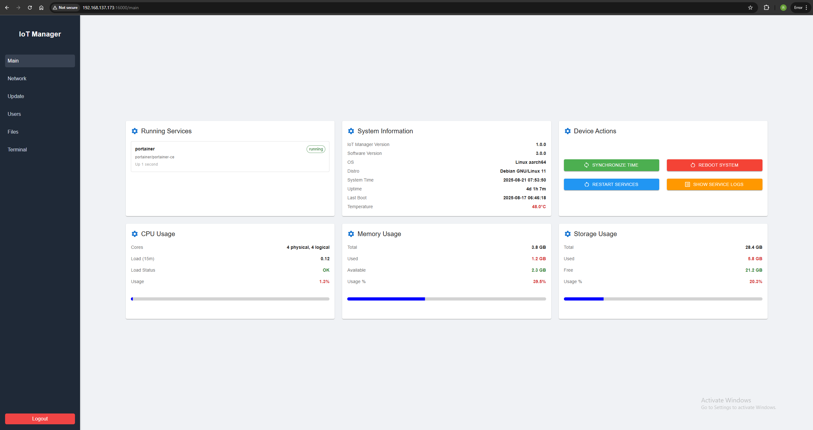
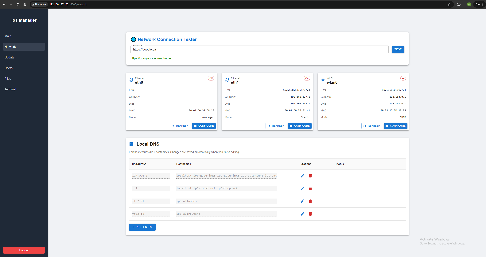
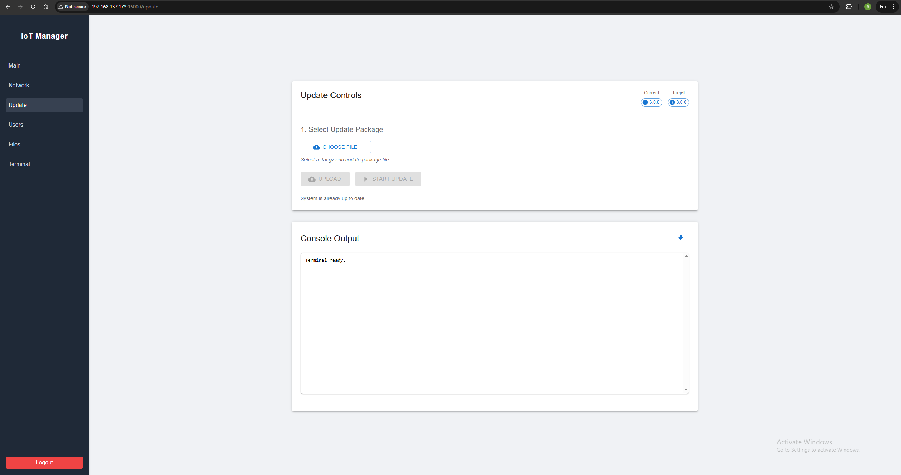
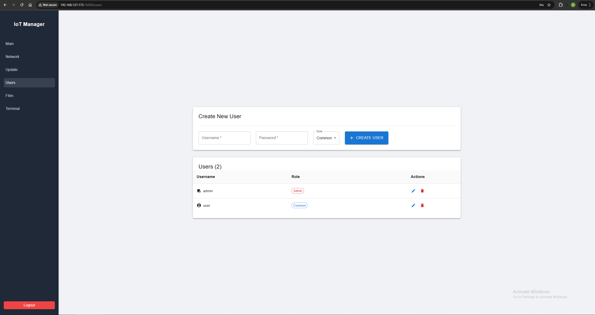
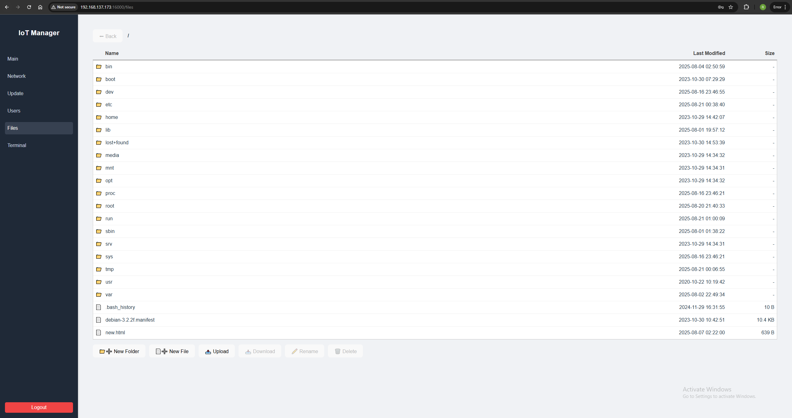
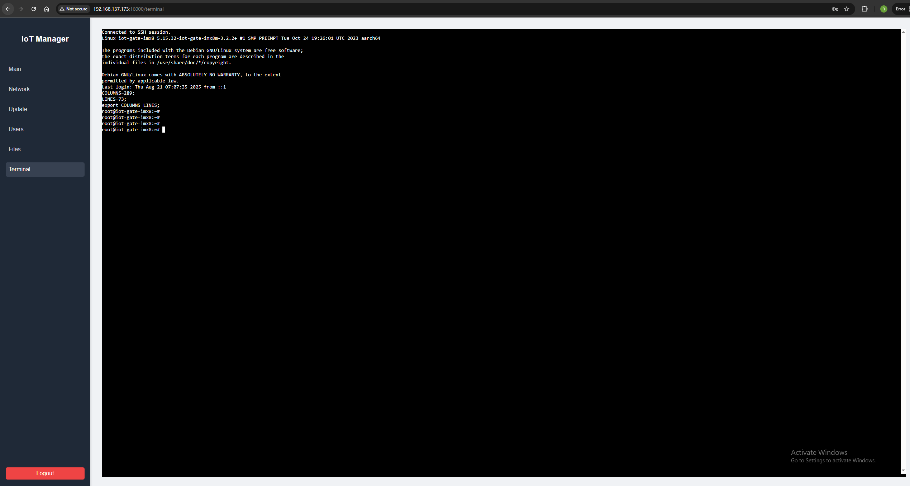

# IoT Device Manager

A comprehensive web-based interface for managing IoT devices, Docker containers, and system configurations through a secure, user-friendly dashboard.

## Table of Contents

- [IoT Device Manager](#iot-device-manager)
  - [Why I Made This](#why-i-made-this)
  - [Features Overview](#features-overview)
    - [📊 Dashboard Overview](#-dashboard-overview)
    - [🌐 Network Configuration](#-network-configuration)
    - [🔄 Secure Updates](#-secure-updates)
    - [👥 User Management](#-user-management)
    - [📁 File Transfer](#-file-transfer)
    - [💻 Remote Terminal](#-remote-terminal)
  - [Installation](#installation)
    - [Prerequisites](#prerequisites)
    - [Quick Install](#quick-install)
  - [Creating Update Bundles](#creating-update-bundles)
    - [Project Structure](#project-structure)
    - [Update Workflow](#update-workflow)
    - [File Descriptions](#file-descriptions)
    - [Example Configuration](#example-configuration)
    - [Bundle Creation Script](#bundle-creation-script)
  - [Getting Started](#getting-started)
  - [System Requirements](#system-requirements)
  - [Frequently Asked Questions](#frequently-asked-questions)
  - [Support & Contributing](#support--contributing)
    - [Get Help](#get-help)
    - [Contributing](#contributing)

## Why I Made This
The term *"IoT"* often implies that devices will always have reliable, stable internet connectivity. As a result, most tools, utilities, and platforms for managing IoT devices — whether for updates, data offloading, or general maintenance — are designed with an always-online use case in mind.  

In reality, internet connectivity is never guaranteed. When devices cannot connect to the outside world, many of those solutions become useless.  

This project was created to fill that gap. It provides a simple interface for performing essential IoT maintenance operations — such as updates, file transfers, and network modifications — **without requiring internet access**. All that’s needed is some form of local connection to the device, whether via LAN Wi-Fi, direct Ethernet, or another offline network.

## Features Overview

### 📊 Dashboard Overview


The main dashboard provides:
- **Real-time system monitoring**: Device status, active containers, and health metrics
- **Service management**: Restart Docker containers and reapply compose configurations
- **System utilities**: Time synchronization, log viewing, and device reboot capabilities
- **Quick actions**: One-click access to common administrative tasks

*Note: Service restarts reapply the Docker Compose configuration, automatically applying any changes to secrets or compose files.*

### 🌐 Network Configuration


Complete network management including:
- **Interface configuration**: Manage network interfaces and IP assignments
- **Wi-Fi connectivity**: Configure wireless connections and credentials
- **DNS settings**: Set custom DNS servers and local resolution
- **Connectivity testing**: Verify external network access

*Important: Network interfaces must be managed through NetworkManager (NMCLI) to be configurable via the web interface.*

### 🔄 Secure Updates


Streamlined offline update system featuring:
- **Encrypted bundles**: Secure `.tar.gz` deployment packages
- **Real-time feedback**: Live progress monitoring during updates
- **Token-based security**: Updates must be encrypted with the installation token

### 👥 User Management


Flexible access control with two user roles:
- **Administrator**: Full access to all features and tabs
- **Standard User**: Limited access to overview, networking, and updates only

*Default credentials are `admin/admin` - change these immediately after installation for security.*

### 📁 File Transfer


Secure file management capabilities:
- **Upload/download**: Transfer files to and from the device
- **Web-based interface**: No need for external tools or SSH access
- **Administrator only**: Restricted to admin users for security

### 💻 Remote Terminal


Direct shell access for advanced users:
- **Web-based terminal**: Full command-line access through the browser
- **Advanced configuration**: System-level troubleshooting and customization
- **Administrator only**: Secure access control

## Installation

### Prerequisites
- Debian/Ubuntu-based system (ARM64 or x86-64)
- Root access
- Internet connection for initial setup

### Quick Install
Run as the `root` user:

```bash
export ENCRYPTION_TOKEN="your-secure-bundle-encryption-password"
apt-get update && apt-get install -y curl && \
curl -L https://raw.githubusercontent.com/username/repo/main/install.sh | bash
```

⚠️ **Important**: Choose a strong encryption token - this will be used to secure your update bundles.

## Creating Update Bundles

### Project Structure
Create your project with this recommended structure:

```
project/
├── docker-compose.yml         # Main Docker Compose configuration
├── .env                       # Environment variables
├── .version                   # Deployment version identifier
├── cmount/                    # Container mount files
│   ├── service1-entrypoint.sh # Service entrypoints
│   └── service2-entrypoint.sh # Configuration files
└── override.sh                # Optional: Custom update logic
```

### Update Workflow  

- **Default behavior (no `override.sh`):**  
  - During an update, everything in this folder is moved to `/etc/device.d/current`.  
  - The updater removes the currently running services (Docker containers) and runs `docker-compose up` using the compose file in this directory.  
  - This approach makes updates easy to revert and minimizes the risk of leaving the system in a bad state.  

- **Custom behavior (with `override.sh`):**
  - If an `override.sh` file is present, the updater will the project/ directory as the working directory.  
  - The updater will then **skip the default container replacement logic** and instead run your script. 
  - ⚠️ **Warning:** Once you take this route, system state is entirely in your hands, and we cannot guarantee rollback or recovery.

### File Descriptions

| File | Purpose | Required |
|------|---------|----------|
| `docker-compose.yml` | Service definitions, networks, and volumes | ✅ Yes |
| `.env` | Environment variables for Docker Compose | ✅ Yes |
| `.version` | Version identifier for tracking deployments | ✅ Yes |
| `cmount/` | Files to be mounted into containers | ✅ Yes |
| `override.sh` | Custom update logic (advanced users only) | ⚠️ Optional |

### Example Configuration

**`.env` file:**
```env
MYSQL_ROOT_PASSWORD=your-secure-password
APP_ENV=production
LOG_LEVEL=info
```

**`docker-compose.yml` example:**
```yaml
version: "3.8"
services:
  portainer:
    image: portainer/portainer-ce:latest
    container_name: portainer
    ports:
      - "9000:9000"
    env_file:
      - /etc/device.d/current/.env
    volumes:
      - /etc/device.d/current/cmount:/cmount
      - /var/run/docker.sock:/var/run/docker.sock
      - portainer_data:/data
    restart: unless-stopped

volumes:
  portainer_data:
```

**`.version` file:**
```
1.0.0
```

### Bundle Creation Script

1. **Authenticate with your container registry** (if using private images):
```bash
docker login -u username -p password registry.example.com
```

2. **Run the bundle creation script:**
```bash
#!/bin/bash
set -e

# Configuration
BUNDLE_FILE="bundle.tar.gz"
ENCRYPTED_BUNDLE_FILE="bundle.tar.gz.enc"
ENCRYPTION_TOKEN=$(cat /etc/update.d/iot_token.txt)
IMAGE_DIR="./images"
BUNDLE_DIR="./bundle"

# Setup directories
mkdir -p "$IMAGE_DIR" "$BUNDLE_DIR"

# Extract and save Docker images
echo "🔄 Processing Docker images..."
images=$(grep 'image:' docker-compose.yml | awk '{print $2}' | sort -u)

for image in $images; do
  filename=$(echo "$image" | sed 's/[\/:]/_/g').tar.gz
  image_path="$IMAGE_DIR/$filename"
  
  echo "📦 Saving image: $image"
  docker pull "$image"
  docker save "$image" | gzip > "$image_path"
done

# Copy project files
echo "📋 Copying project files..."
cp -r docker-compose.yml .env .version "$IMAGE_DIR" "$BUNDLE_DIR/"
[ -d "cmount" ] && cp -r cmount/ "$BUNDLE_DIR/"
[ -f "override.sh" ] && cp override.sh "$BUNDLE_DIR/"

# Create encrypted bundle
echo "🔐 Creating encrypted bundle..."
tar -czf "$BUNDLE_FILE" -C "$BUNDLE_DIR" .
openssl enc -aes-256-cbc -salt -pbkdf2 -in "$BUNDLE_FILE" -out "$ENCRYPTED_BUNDLE_FILE" -pass pass:"$ENCRYPTION_TOKEN"

# Cleanup
rm -rf "$IMAGE_DIR" "$BUNDLE_DIR" "$BUNDLE_FILE"

echo "✅ Bundle created: $ENCRYPTED_BUNDLE_FILE"
```

## Getting Started

1. **Access the web interface**: Navigate to `http://your-device-ip:16000`
2. **Initial login**: Use credentials `admin/admin`
3. **Secure your installation**: 
   - Change the default admin password immediately
   - Create additional users as needed
   - Configure network settings

## System Requirements

| Component | ARM64 Systems | x86-64 Systems |
|-----------|---------------|----------------|
| **CPU** | 2 cores (Cortex-A53 1.8GHz+) | 1 core (2.0GHz+) |
| **Memory** | 2GB RAM | 2GB RAM |
| **Storage** | 8GB available space | 8GB available space |
| **OS** | Debian/Ubuntu ARM64 | Debian/Ubuntu x86-64 |

*Tested and verified on ARM Cortex-A53 IoT gateway hardware with ~5% CPU utilization.*

## Frequently Asked Questions

### Q: What devices are supported?
**A:** Currently supports Debian and Ubuntu-based systems with ARM64 or x86-64 architecture. Additional Linux distributions may be supported in future releases.

### Q: Is remote/online management available?
**A:** Online management is not currently built-in, but this is a planned feature. You may integrate third-party remote management tools, though compatibility is not guaranteed.

### Q: How secure are the update bundles?
**A:** Update bundles use AES-256-CBC encryption with PBKDF2 key derivation. Only bundles encrypted with your installation token can be deployed.

### Q: Can I customize the interface?
**A:** The interface is designed for reliability and consistency. Customization options may be added in future versions based on user feedback.

### Q: What happens if an update fails?
**A:**

- Containerized update workflow: Simply perform another update using the previous working version to restore a stable state. Then examine the logs to identify the error source and fix it.
- override.sh workflow: There is no guarantee that applying a previous bundle will restore a working state. Use the terminal and logs to troubleshoot the issue. Alternatively, create a corrective update bundle that leverages `override.sh` to try and resolve the problem.

## Support & Contributing

### Get Help
- **Discussions**: Use the GitHub Discussions section for questions and community support
- **Email**: Contact the maintainer at `randyk98@hotmail.com`
- **Issues**: Report bugs and feature requests via GitHub Issues

### Contributing
Contributions are welcome! Please read the contributing guidelines and submit pull requests for review.

---

*This project is designed for reliability and security in IoT deployments. Always test updates in a development environment before production deployment.*